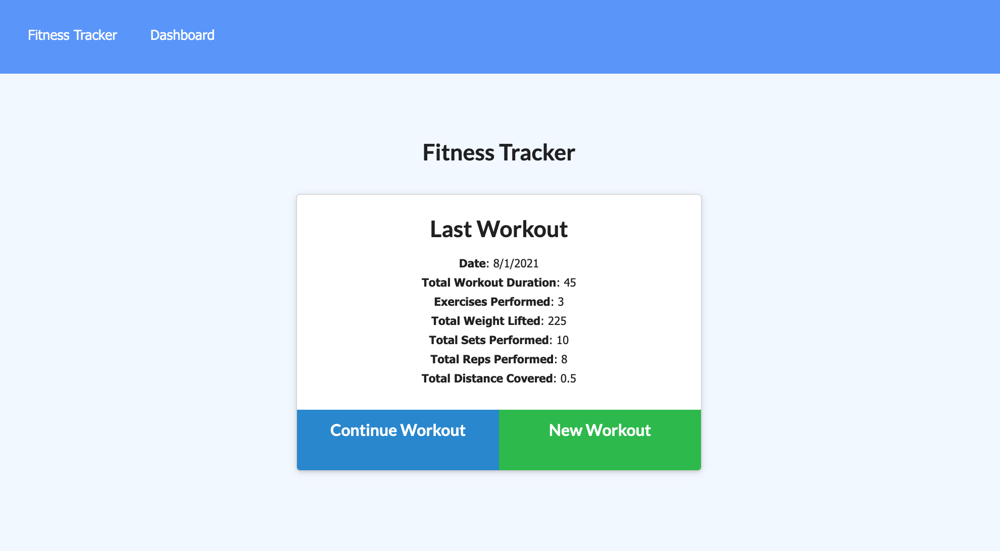

# Fitness Tracker

## Description
- A fitness tracker which allows the user to add exercises and see their fitness stats

### Installation
- The project is uploaded to [GitHub](https://github.com/) at the following repository: [here](https://github.com/sourslaw/18_Workout_Tracker)
- The project is deployed via [Heroku](https://www.heroku.com/) at the following link: [here](https://shrouded-chamber-26044.herokuapp.com/)

### Credits
- [Express](https://expressjs.com/)
- [MongoDB](https://www.mongodb.com/)

### License
- Licensed under the [MIT](https://opensource.org/licenses/mit-license.php) license.